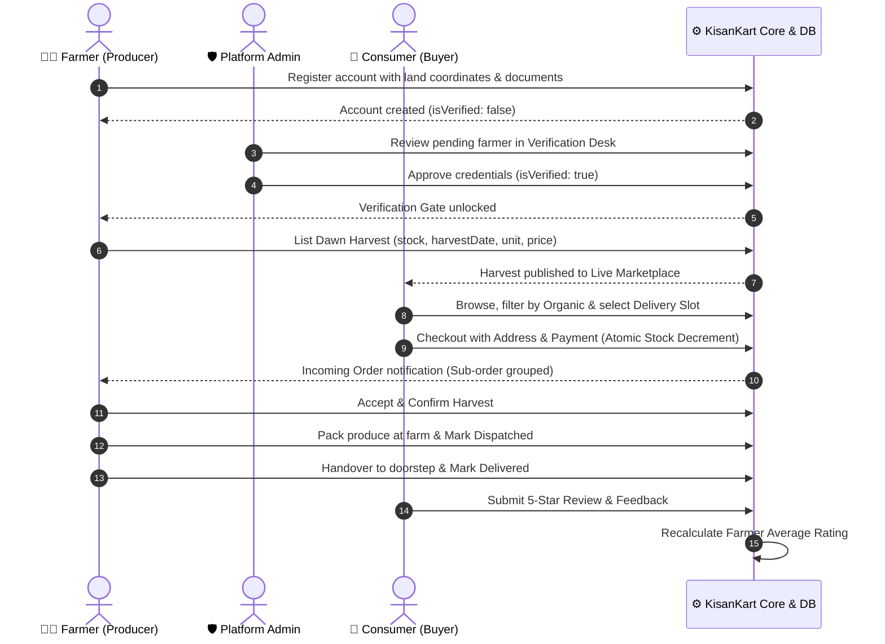

# KisanKart: System Architecture & Complete Workflow Guide

## 1. Executive Overview

**KisanKart** is a direct Farmer-to-Consumer (F2C) agricultural marketplace built to eliminate intermediary commission agents and wholesalers. The platform enables local agricultural producers to list dawn harvests at transparent prices, while consumers receive fresh, organic, and traceable produce delivered in dedicated morning slots with zero cold-storage holding lag.

---

## 2. End-to-End Persona Workflows & Sequence Diagrams



---

## 3. Detailed Role-Based User Journeys

### A. Consumer Workflow (`/marketplace`, `/products/[id]`, `/cart`, `/checkout`, `/dashboard/consumer`)

1. **Discovery & Smart Filtering:**
   - Consumers land on the marketplace and apply multi-faceted filters:
     - **Category:** Vegetables, Fruits, Dairy (A2 Milk & Vedic Ghee), Whole Grains, Pulses, Cold-Pressed Oils.
     - **Purity Standard:** `100% Certified Organic Only` toggle.
     - **Farming Practice:** Organic Bio-Certified, Natural (Jeevamrutha/Vedic), or Conventional.
     - **Location Radius:** Filter by source hub (Pune, Nashik, Indore).
     - **Recency Sorting:** Sort by "Freshest Harvest First" (calculated in real-time from `harvestDate`).
2. **Traceability Verification:**
   - On the product detail page, consumers inspect:
     - **Harvest Freshness Badge:** Dynamic indicator (e.g. `🟢 Harvested 8h ago`, `Harvested yesterday`).
     - **Grower Profile Trust Card:** Farm name, grower biography, GPS coordinates, certification numbers (NPOP / Jaivik Bharat), and historical ratings.
3. **Multi-Farmer Cart & Checkout:**
   - Items added from multiple farmers are grouped transparently by source farm in the cart.
   - **Delivery Slot Selection:** Preferred date (Tomorrow, Day after) and time window (`07:00 AM - 10:00 AM Early Morning`, `12:00 PM - 03:00 PM Midday`, `05:00 PM - 08:00 PM Evening`).
   - **Payment Simulation:** Choose between Instant Online Payment (UPI/Card with instant receipt) or Cash on Delivery (COD).
4. **Atomic Order Placement:**
   - The system checks stock availability and performs an atomic database decrement.
   - Separate sub-orders are generated for each individual farmer (`KM-XXXXXX-1`, `KM-XXXXXX-2`) ensuring independent farm fulfillment.
5. **Live Tracking & Ratings:**
   - Consumers track the 4-stage visual timeline on their dashboard:
     $$\text{Placed} \longrightarrow \text{Confirmed} \longrightarrow \text{Dispatched} \longrightarrow \text{Delivered}$$
   - Once marked `delivered`, the consumer unlocks an interactive 1–5 star review modal.

---

### B. Farmer Workflow (`/dashboard/farmer`, `/farmers/[id]`)

1. **Registration & Verification Gate:**
   - Farmers register with farm name, location coordinates, primary crops, farming method, and certificate URLs.
   - **Verification Gate Policy:** By default, new farmer accounts have `isVerified: false`. The system disables product listing creation until an admin verifies their documentation, displaying an informational amber banner.
2. **Dawn Harvest Management:**
   - Verified farmers create listings by specifying:
     - Produce Name, Category, Unit (`kg`, `g`, `litre`, `dozen`, `bundle`, `piece`).
     - Price per unit (100% direct realization with ₹0 middleman cut).
     - Available Stock Quantity and exact Harvest Date.
     - 100% Organic certified toggle and photo URL.
   - Farmers can quickly adjust stock, toggle active availability, and edit or delete listings.
3. **Fulfillment Progression:**
   - In the **Incoming Orders** tab, farmers view customer delivery slots, addresses, and line items.
   - They advance order status:
     - `Accept & Confirm Harvest` $\rightarrow$ Order status becomes `confirmed`.
     - `Mark Out for Delivery` $\rightarrow$ Order status becomes `dispatched`.
     - `Mark Delivered` $\rightarrow$ Order status becomes `delivered` (and COD payment status becomes `paid`).
4. **Revenue & Ratings Analytics:**
   - Farmers track total GMV revenue, active listing counts, pending fulfillments, and customer star rating distribution.

---

### C. Platform Administrator Workflow (`/dashboard/admin`)

1. **Verification Desk:**
   - Inspects pending farmer registration applications in real-time.
   - Views submitted certificates (NPOP organic certificates, APMC trader passes, FSSAI dairy permits) and location details.
   - 1-Click `Approve & Verify` or `Reject` triggers immediate status updates.
2. **Platform KPI Governance:**
   - **Gross Merchandise Value (GMV):** Real-time sum of all non-cancelled orders.
   - **Fulfillment Completion Rate (%):** Percentage of placed orders successfully delivered.
   - **Farmer Metrics:** Total onboarded farmers, verified active farmers, and pending review queue.
   - **Consumer Directory:** Total registered buyers and marketplace inventory count.

---

## 4. Key Architectural & Database Mechanics

### A. Atomic Stock Decrement & Multi-Farmer Order Engine
```typescript
// Located at: src/app/api/orders/route.ts
// 1. Stock Validation
for (const item of items) {
  const dbProduct = productMap.get(item.productId);
  if (dbProduct.stockQuantity < item.quantity) {
    return NextResponse.json({ error: `Insufficient stock for ${dbProduct.name}` }, { status: 400 });
  }
}

// 2. Atomic Decrement
for (const item of items) {
  await Product.findOneAndUpdate(
    { _id: item.productId, stockQuantity: { $gte: item.quantity } },
    { $inc: { stockQuantity: -item.quantity } },
    { new: true }
  );
}

// 3. Multi-Farmer Split Creation
for (const [farmerId, farmerItems] of farmerGrouped.entries()) {
  await Order.create({
    orderNumber: `KM-${timestamp}-${orderIndex++}`,
    consumerId: auth.userId,
    farmerId,
    items: farmerItems,
    totalAmount: subtotal,
    deliverySlot,
    shippingAddress,
    status: 'pending',
    paymentMethod,
  });
}
```

### B. Dynamic Harvest Freshness Recency Logic
```typescript
// Located at: src/components/HarvestFreshnessBadge.tsx
const diffHours = Math.round((now - harvestTime) / (1000 * 60 * 60));
const diffDays = Math.floor(diffHours / 24);

if (diffHours < 12) text = `Harvested ${diffHours || 1}h ago`; // Glowing Green Pulse
else if (diffDays === 1) text = `Harvested yesterday`;
else text = `Harvested ${diffDays} days ago`; // Amber tag
```
